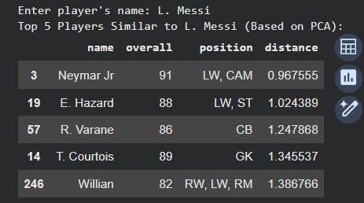

# ⚽ PCA-Based Football Player Style Mapping

### 🧠 Overview
This project applies **Principal Component Analysis (PCA)** to **FIFA 21 player data** to visualize and compare footballers based on their attributes.  
By reducing multiple skill attributes (such as pace, shooting, passing, dribbling, defending, and physicality) into two principal components,  
we can **map player styles**, **understand performance patterns**, and **find similar players**.

---

## 📊 Objective
To identify relationships between football players based on their performance attributes and visualize how their play styles differ using PCA.

---

## 📁 Dataset
- **Source:** [FIFA 21 Player Dataset – Kaggle](https://www.kaggle.com/stefanoleone992/fifa-21-complete-player-dataset)
- **File Used:** `FIFA21.xlsx` (Sheet: *FIFA 21*)
- **Attributes Considered:**
  - `pace`
  - `shooting`
  - `passing`
  - `dribbling`
  - `defending`
  - `physic`

---

## ⚙️ Methodology
1. **Data Cleaning:**  
   - Loaded the FIFA 21 dataset (Excel format)  
   - Selected the top 300 players based on overall rating  
   - Extracted six key performance attributes  

2. **Preprocessing:**  
   - Standardized features using `StandardScaler`  
   - Removed missing values  

3. **Principal Component Analysis (PCA):**  
   - Reduced 6 features to 2 principal components  
   - PC1 captures *Attacking vs Defensive* tendencies  
   - PC2 captures *Physical vs Technical* tendencies  

4. **Visualization & Similarity Search:**  
   - 2D scatter plot (colored by overall rating)  
   - Top 5 most similar players identified using Euclidean distance in PCA space  

---

## 🎨 Visualizations

### PCA Scatter Plot (Colored by Overall Rating)

**Interpretation:**
- **Right side (high PC1):** Attackers (fast, skillful, offensive)  
- **Left side (low PC1):** Defenders (strong, defensive-minded)  
- **Top (high PC2):** Physical, defensive players  
- **Bottom (low PC2):** Technical, agile players  

---

### Similar Player Finder

---

## 🧩 Interpretation of Principal Components

| Component | Major Contributing Features | Meaning |
|:--|:--|:--|
| **PC1** | ↑ pace, ↑ shooting, ↑ dribbling, ↓ defending, ↓ physic | *Attacking vs Defensive* style |
| **PC2** | ↑ defending, ↑ physic, ↑ passing | *Physical vs Technical* profile |

---

## 🚀 Technologies Used
- Python 
- Libraries: `pandas`, `numpy`, `matplotlib`, `seaborn`, `sklearn`  
- Tool: Google Colab 

---

## 📈 Key Insights
- PCA effectively visualizes high-dimensional player attributes in 2D.  
- Clear separation between attacking and defensive play styles.  
- Similarity search helps identify players with comparable playstyle metrics.  
- Dimensionality reduction helps reveal structure in complex football data.

---
